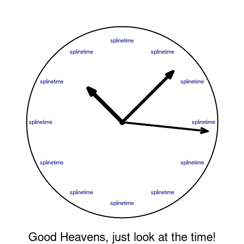

```{r, include = FALSE}
knitr::opts_chunk$set(
  collapse = TRUE,
  comment = "#>",
  fig.path = "man/figures/README-",
  out.width = "100%"
)
```

# splinetime



## Table of Contents

-   [Introduction](#introduction)
-   [Installation](#installation)
-   [Usage](#usage)
    -   [limma_hyperparams_screen](#limma_hyperparams_screen)
    -   [run_limma_splines](#run_limma_splines)
    -   [cluster_hits](#cluster_hits)
-   [Dependencies](#dependencies)
-   [System Requirements](#system-requirements)
-   [Getting Help](#getting-help)
-   [Contributing](#contributing)
-   [License](#license)
-   [Citation](#citation)

## Introduction {#introduction}

Welcome to `splinetime`, an R package designed to streamline the analysis of omics time-series data, followed by automated HTML report generation.

Note: Understanding what this package does requires being familiar at least to some extent with the following topics:

-   The R package `limma`. limma is used for hypothesis testing here.

-   Splines. The timeseries omics data will be analysed with splines.

### Is this package of use for me?

If you have a data matrix from a time-series omics experiment (e.g. proteomics metabolomics, transcriptomics, etc.) that looks like this (this is an example of a time-series proteomics dataset, coming from a CHO cell cultivation, carried out in three reactors (three replicated per timepoint). E9, E10, E12 describes the ID of the reactor, TP01, TP02, etc., the timepoint of the measurement):

```{r data example, echo=FALSE, include=TRUE}
library(here)
library(readxl)
library(knitr)
library(ggplot2)
library(gridExtra)
library(grid)

knitr::opts_chunk$set(echo = TRUE, message = FALSE, warning = FALSE)

input_file_path <- here::here("data", "timeseries_proteomics_example.RData")
load(input_file_path) 
data <- as.matrix(data)
data_head <- head(data[, 1:7], 10)

# Format numbers to two decimal places
data_head <- apply(data_head, 2, function(x) format(round(x, 2), nsmall = 2))

# Truncate column headers
colnames(data_head) <- sub("_[^_]+$", "", colnames(data_head))

table_plot1 <- tableGrob(data_head)

# Adjust the grobs within the tableGrob to reduce margins
table_plot1$heights <- unit(rep(1, nrow(data_head) + 1), "null")
table_plot1$widths <- unit(rep(1, ncol(data_head) + 1), "null")

grid.newpage()
grid.draw(table_plot1)
```

where every row is a feature (protein, metabolite, gene) and every column is a sample, taken at a specific time, and the values are the measurement values (e.g intensities, etc.).

And if you further have a dataframe, containing the meta information, that looks like this:

```{r meta example, echo=FALSE, include=TRUE}
library(here)
library(readxl)
library(knitr)
library(ggplot2)
library(gridExtra)
library(grid)

knitr::opts_chunk$set(echo = TRUE, message = FALSE, warning = FALSE)

input_file_path <- here::here("data", "timeseries_proteomics_example.RData")
load(input_file_path) 
meta_head <- head(meta[, 1:5], 10)
meta_head$Sample <- sub("_[^_]+$", "", meta_head$Sample)

table_plot2 <- tableGrob(meta_head)
table_plot2$heights <- unit(rep(1, nrow(meta_head) + 1), "null")
table_plot2$widths <- unit(rep(1, ncol(meta_head) + 1), "null")

grid.newpage()
grid.draw(table_plot2)
```

where every row describes a sample (column of the data matrix), and the columns contain the different meta information, such as as Time.Point (the ID of the time point) and Time (here describing the time to the feeding of the CHO cells in the bioreactor).

And if you want to achieve one or more of the following things:

-   Find out which of the features (rows of the data matrix) (e.g. which of the proteins, metabolites, etc.) are changed significantly over the time and get a p-value for them.

-   Cluster the hits (the significant features) based on their temporal pattern. For example, some hits may continually decrease in value (e.g. intensity) over the time, while others may increase. Each of the unique temporal pattern would be put into one cluster, which sets the stage for example for gene set enrichment analysis (check the enrichment terms for each cluster. For example, when one cluster contains proteins that increase in abundance over the time, the enrichment could tell you which processes got activated.)

-   Generate a report, that shows the temporal pattern of every hit and the resulting clusters, along with other plots such as a dendrogram, showing the hierarchical clustering employed, and a heatmap showing the logfold changes. You can view an example report here: [HTML report](https://csbg.github.io/splinetime/example_report.html)

Then the `splinetime` package could be of interest to you. This package finds the hits by applying splines (piece wise polynomial curves) to the time-series omics data and using the R package `limma` to find out, in a nutshell, which of the features have splines that are significantly different from horizontal (which would mean that nothing happens over the time, therefore no significant change).

Here an example of a hit (significant feature):


The datapoints of the triplicates are close together and there is a clear temporal pattern. This is from a proteomics example, so this protein here would decrease in abundance over the timecourse.

Here an example of a feature, that is not significant (no hit):


The datapoints are scattered and there is no clear temporal pattern. The conclusion for this protein would be that there is no significant change in abundance over the timecourse.

### Finding the right parameters for the limma spline analysis

Above you have seen that you can fit splines to your timeseries omics data and determine which features are significantly changed over the timecourse. However, should you use B-splines or natural cubic splines for your dataset, and with which degree of freedom? Should you remove outliers of your dataset? Which limma design formula should you use? Here, we call these decisions hyperparameters. We believe it is not straightforward answering these questions without testing their impact on the actual analysis. That is why the `splinetime` package contains a function to streamline the exploration of the different combination of these hyperparameters. With that function, you can very quickly and systematically explore which effect your hyperparameter choices have on your analysis. For example, you are not sure if you should use a degree of freedom for natural cubic splines of 2, 3, 4, or 5, and whether to remove the two potential outliers of your dataset, or just one, or just the other. This already results in a lot of different combinations of your decisions. With the function `limma_hyperparams_screen()` you can just easily plug in all the desired degrees of freedoms and version of your data (outliers removed vs. not removed, etc.) and see the impact in a series of automatically generated HTML reports.

### Summary

With `splinetime`, you can:

-   **Explore Various Hyperparameters:** The `limma_hyperparams_screen()` function offers a comprehensive way to test combinations of hyperparameters, such as different datasets, `limma` design formulas, degrees of freedom, and p-value thresholds. This enables users to evaluate the impact of various settings on their analysis results systematically.

-   **Perform Limma Spline Analysis:** Once the optimal hyperparameters are identified, `run_limma_splines()` performs the limma analysis using splines.

-   **Cluster Significant Features:** The `cluster_hits()` function goes a step further by clustering the significant features (hits) identified in the spline analysis. It organizes these features into meaningful groups and generates a comprehensive report, facilitating the interpretation and communication of the results.

## Installation {#installation}

Follow these steps to install the `splinetime` package from its GitHub repository into your R environment.

#### Prerequisites

-   Ensure **R** is installed on your system. If not, download and install it from [CRAN](https://cran.r-project.org/).
-   **RStudio** is recommended for a more user-friendly experience with R. Download and install RStudio from [rstudio.com](https://www.rstudio.com/products/rstudio/download/).

#### Installation Steps

1.  **Open RStudio** or your R console.

2.  Install the `devtools` package if you haven't already. You can do this by running the following command in the R console:

    ``` r
    install.packages("devtools")
    ```

3.  Load the `devtools` package into your R session, and run the install_github function to install the splinetime package into your RProject:

    ``` r
    library(devtools)
    Sys.setenv(GITHUB_PAT = "your_GitHub_PAT")
    devtools::install_github("csbg/splinetime")
    ```

    This command downloads and installs the splinetime package from the GitHub repository.

4.  Wait for the installation to complete. This process may take a few moments as it involves downloading the package and its dependencies. You might see messages in the console regarding the installation progress or be prompted to update other packages.

5.  Once installation is complete, load the splinetime package into your R session to start using it. Run:

    ``` r
    library(splinetime)
    ```

6.  Congratulations! You have successfully installed the splinetime package from GitHub. You're now ready to use its functions in your R projects.

#### Troubleshooting

If you encounter errors related to dependencies or package versions during installation, try updating your R and RStudio to the latest versions and repeat the installation steps.

For issues specifically related to the splinetime package, check the Issues section of the GitHub repository for similar problems or to post a new issue.

### Usage {#usage}

The `splinetime` package provides comprehensive tools for analyzing time-course data, focusing on differential expression analysis and clustering. This section covers detailed instructions for utilizing each of the package's main functions.

#### limma_hyperparams_screen {#limma_hyperparams_screen}

Conducts a hyperparameter screening using the `limma` package to identify optimal parameters for differential expression analysis across multiple datasets.

##### Arguments

-   **datas**: A list of expression matrices (data frames or matrices), each representing a distinct dataset.

-   **datas_descr**: A character vector describing each dataset in `datas`. Example: `c("full_data", "outliers_removed")`.

-   **metas**: A list of metadata data frames corresponding to each dataset in `datas`. Each metadata frame should contain experimental conditions and batch information.

-   **designs**: A character vector of model design formulas for differential expression analysis.

-   **modes**: A character vector indicating the mode of analysis for each design. Example: `c("integrated", "isolated")`.

-   **condition**: The name of the experimental condition factor in the metadata.

-   **spline_test_configs**: A list of configurations for testing different spline parameters, including degrees of freedom and spline types.

-   **feature_names**: A character vector of feature names (e.g., gene or protein names) for annotation.

-   **report_info**: Information that gets printed on top of the report, providing context or additional details about the analysis.

-   **report_dir**: Directory path for saving the output reports.

-   **pthresholds**: A numeric vector of p-value thresholds for determining statistical significance.

-   **meta_batch_column**: A character string specifying the column in `meta` used to remove batch effects. Default is `NA`.

##### Example Usage

``` r
result <- limma_hyperparams_screen(
  datas = datas,
  datas_descr = datas_descr,
  metas = metas,
  designs = designs,
  modes = modes,
  condition = condition,
  spline_test_configs = spline_test_configs,
  feature_names = feature_names,
  report_info = report_info,
  report_dir = report_dir,
  pthresholds = pthresholds,
  meta_batch_column = meta_batch_column
)
```

### run_limma_splines {#run_limma_splines}

This function performs differential expression analysis tailored for time-course data using spline models via the `limma` package. It's designed to handle complex experimental designs and time as a continuous variable.

#### Arguments

-   **data**: Expression matrix (either a data frame or matrix) representing gene expression levels where rows correspond to features (e.g., genes, proteins) and columns correspond to samples.

-   **meta**: Metadata frame corresponding to the samples in the `data` matrix. This should include at least the experimental condition and the batch information if any batch effect removal is intended.

-   **design**: A character string specifying the model design formula for the differential expression analysis. The design should incorporate the experimental conditions and may also include interaction terms.

-   **condition**: The name of the experimental condition factor within the `meta` data frame. This specifies the main variable of interest for differential expression analysis.

-   **feature_names**: A character vector containing the names of the features (e.g., gene names, protein IDs) for annotation purposes.

-   **mode**: A character string specifying the mode of analysis, which can be either "integrated" for a comprehensive model including all factors or "isolated" to focus on specific factors or interactions.

-   **spline_params**: A list specifying the spline parameters, including `spline_type` (type of spline) and `DoFs` (degrees of freedom).

-   **padjust_method**: A character string specifying the method for p-value adjustment. Default is "BH" (Benjamini-Hochberg).

#### Example Usage

``` r
result <- run_limma_splines(
  data = data, 
  meta = meta, 
  design = design, 
  spline_params = spline_params,
  condition = condition, 
  feature_names = feature_names, 
  mode = "integrated",
  padjust_method = "BH"
)
```

### cluster_hits {#cluster_hits}

Clusters significant features based on their expression profiles, following differential expression analysis. This function helps identify groups of features (e.g., genes, proteins) that exhibit similar expression patterns across different conditions or time points.

#### Arguments

-   **top_tables**: A list containing the top tables from limma. Each top table should be a data frame with significant features identified by the analysis, including their p-values and other statistics.

-   **data**: An matrix (data frame or matrix) with rows representing features and columns representing samples.

-   **meta**: Metadata frame corresponding to the samples in the `data` matrix. This frame should include variables that describe the experimental conditions, batches, or other grouping factors relevant to the analysis.

-   **condition**: A character string specifying the column in `meta` that contains the experimental conditions or groupings used for the analysis.

-   **report_info**: Information that gets printed on top of the report, providing context or additional details about the analysis.

-   **mode**: A character string specifying the mode of the analysis. Default is `"integrated"`, depending on the limma design.

-   **spline_params**: A list specifying the spline parameters, including `spline_type` (type of spline) and `DoFs` (degrees of freedom).

-   **p_values**: A numeric vector specifying the p-value thresholds for features to be included in the clustering analysis. Only features with p-values below these thresholds in the differential expression analysis will be considered.

-   **clusters**: An integer vector or `"auto"` specifying the number of clusters to generate. This allows for different levels of granularity in the clustering analysis, depending on the desired number of feature groups.

-   **meta_batch_column**: A character string specifying the column in `meta` used to remove batch effects. Default is `NA`.

-   **time_unit**: A character string specifying the time unit for the plot labels. Default is `"m"` (minutes).

-   **report_dir**: The directory path where clustering results, including any plots or summary tables, will be saved. This allows for easy access and review of the clustering outputs.

#### Example Usage

``` r
clustering_results <- cluster_hits(
  top_tables = top_tables, 
  data = data, 
  meta = meta, 
  condition = condition, 
  spline_params = spline_params,
  mode = "integrated",
  p_values = p_values,
  clusters = clusters,
  report_info = report_info,
  meta_batch_column = meta_batch_column,
  report_dir = report_dir
)
```

## Dependencies {#dependencies}

The `splinetime` package relies on several other R packages for its functionality. Below is a list of dependencies that will be installed along with `splinetime`. If you already have these packages installed, ensure they are up to date to avoid any compatibility issues.

-   **limma**: For linear models for microarray data.
-   **splines**: Provides functions for regression spline fitting and extraction.
-   **purrr**: For functional programming tools.
-   **ggplot2**: For creating elegant data visualizations using the grammar of graphics.
-   **tidyr**: For tidying your data.
-   **dplyr**: For data manipulation.
-   **tibble**: For creating tidy data frames that are easy to work with.
-   **dendextend**: For extending `dendrogram` objects in R, allowing for easier manipulation of dendrograms.
-   **RColorBrewer**: For providing color palettes for data visualization.
-   **patchwork**: For combining multiple ggplot objects into a single plot.
-   **ComplexHeatmap**: For creating complex heatmaps with advanced features.
-   **circlize**: For circular visualization of data.
-   **grid**: For low-level graphics functions and utilities.
-   **cluster**: For clustering algorithms such as hierarchical clustering.
-   **stats**: Provides functions for statistical calculations and random number generation (included with base R).
-   **furrr**: Provides tools for applying functions to elements of a list concurrently.
-   **stringr**: Simplifies the manipulation of strings.
-   **progress**: For adding progress bars to your loops and apply functions.
-   **here**: For constructing paths to your project's files.
-   **knitr**: For dynamic report generation in R.
-   **kableExtra**: For producing beautiful tables in R Markdown documents.
-   **ragg**: For creating high-quality images for graphics devices.

To ensure a smooth installation and functionality of `splinetime`, these dependencies will be automatically checked and, if necessary, installed upon installing `splinetime`.

### R Version

-   Required: R 4.3.3 or higher
    -   Note: This project was developed using R 4.3.3. While it should be compatible with newer versions, this is the version guaranteed to work as tested.

## Getting Help {#getting-help}

If you encounter a bug or have a suggestion for improving the `splinetime` package, we encourage you to [open an issue](https://github.com/csbg/splinetime/issues) on our GitHub repository. Before opening a new issue, please check to see if your question or bug has already been reported by another user. This helps avoid duplicate reports and ensures that we can address problems efficiently.

For more detailed questions, discussions, or contributions regarding the package's use and development, please refer to the [GitHub Discussions](https://github.com/csbg/splinetime/discussions) page for `splinetime`. This forum is a great place to ask for help, share your experiences, and connect with the community.

Thank you for using and contributing to the development of `splinetime`!

## Contributing {#contributing}

We welcome contributions to the `splinetime` package! Whether you're interested in fixing bugs, adding new features, or improving documentation, your help is greatly appreciated.

Here's how you can contribute:

1.  **Report a Bug or Request a Feature:** If you encounter a bug or have an idea for a new feature, please [open an issue](https://github.com/csbg/splinetime/issues) on our GitHub repository. Before opening a new issue, check to see if the issue has already been reported or the feature requested by another user.

2.  **Submit a Pull Request:** If you've developed a bug fix or a new feature that you'd like to share, submit a pull request. Here are the steps:

    -   Fork the repository.
    -   Create a new branch in your fork for your contributions.
    -   Commit your changes to the branch.
    -   Push the branch to your fork.
    -   Submit a pull request to the `splinetime` repository from your fork and branch.
    -   Please describe your changes clearly in the pull request description and reference any related issues.

3.  **Improve Documentation:** Good documentation is crucial for any project. If you notice missing or incorrect documentation, please feel free to contribute.

Please adhere to our [Code of Conduct](CODE_OF_CONDUCT.md) in all your interactions with the project.

Thank you for considering contributing to `splinetime`. Your efforts are what make the open-source community a fantastic place to learn, inspire, and create.

## Licence

`splinetime` is open-sourced software licensed under the [MIT license](LICENSE).

## Citation {#citation}

The `splinetime` package is currently not published in a peer-reviewed scientific journal or similar outlet, and as such, there is no formal citation requirement associated with its use. You are free to use `splinetime` without citing it. However, we appreciate acknowledgements in your projects or publications that benefit from this package. Your support helps us in the continued development and improvement of `splinetime`. Thank you for using our package!
