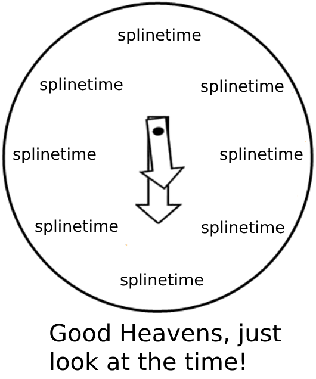

<h1 align="center">

splinetime

</h1>

<br>

<p align="center">



</p>

<br><br>

# Table of Contents

-   [Introduction](#introduction)
-   [Installation](#installation)
-   [Usage](#usage)
    -   [limma_hyperparams_screen](#limma_hyperparams_screen)
    -   [run_limma_splines](#run_limma_splines)
    -   [cluster_hits](#cluster_hits)
-   [Dependencies](#dependencies)
-   [System Requirements](#system-requirements)
-   [Getting Help](#getting-help)
-   [Contributing](#contributing)
-   [License](#license)
-   [Citation](#citation)

# Introduction

Welcome to `splinetime`, an R package designed to streamline the analysis of time-series data by leveraging the power of splines—piecewise polynomial functions—and the robust statistical framework of `limma` for hypothesis testing. This package simplifies the complex process of time-series analysis, making it accessible and efficient for researchers and data analysts alike.

With `splinetime`, users can:

-   **Explore Various Hyperparameters:** The `limma_hyperparams_screen()` function offers a comprehensive way to test combinations of hyperparameters, such as different datasets, `limma` design formulas, degrees of freedom, and p-value thresholds. This enables users to evaluate the impact of various settings on their analysis results systematically.

-   **Perform Limma Spline Analysis:** Once the optimal hyperparameters are identified, `run_limma_splines()` performs the differential expression analysis using splines.

-   **Cluster Significant Features:** The `cluster_hits()` function goes a step further by clustering the significant features identified in the spline analysis. It organizes these features into meaningful groups and generates a comprehensive report, facilitating the interpretation and communication of the results.

`splinetime` is here to support your journey through the intricate landscape of time-series analysis, offering a clear path through the selection of hyperparameters to the final report. Embrace the power of splines and `limma` with `splinetime`, and unlock the full potential of your data.

## Installation 

Follow these steps to install the `splinetime` package from its GitHub repository into your R environment.

### Prerequisites

-   Ensure **R** is installed on your system. If not, download and install it from [CRAN](https://cran.r-project.org/).
-   **RStudio** is recommended for a more user-friendly experience with R. Download and install RStudio from [rstudio.com](https://www.rstudio.com/products/rstudio/download/).

### Installation Steps

1.  **Open RStudio** or your R console.

2.  Install the `devtools` package if you haven't already. You can do this by running the following command in the R console:

    ``` r
    install.packages("devtools")
    ```

3.  Load the devtools package into your R session with the following command:

    ``` r
    library(devtools)
    ```

4.  To install the splinetime package, run the following command:

    ``` r
    devtools::install_github("csbg/splinetime")
    ```

    This command downloads and installs the splinetime package from the specified GitHub repository.

5.  Wait for the installation to complete. This process may take a few moments as it involves downloading the package and its dependencies. You might see messages in the console regarding the installation progress or be prompted to update other packages.

6.  Once installation is complete, load the splinetime package into your R session to start using it. Run:

    ``` r
    library(splinetime)
    ```

7.  Congratulations! You have successfully installed the splinetime package from GitHub. You're now ready to use its functions in your R projects.

### Troubleshooting

If you encounter errors related to dependencies or package versions during installation, try updating your R and RStudio to the latest versions and repeat the installation steps.

For issues specifically related to the splinetime package, check the Issues section of the GitHub repository for similar problems or to post a new issue.

## Usage

The `splinetime` package provides comprehensive tools for analyzing time-course data, focusing on differential expression analysis and clustering. This section covers detailed instructions for utilizing each of the package's main functions.

### limma_hyperparams_screen

Conducts a hyperparameter screening using the `limma` package to identify optimal parameters for differential expression analysis across multiple datasets.

#### Arguments

-   **datas**: A list of expression matrices (data frames or matrices), each representing a distinct dataset.
-   **datas_descr**: A character vector describing each dataset in `datas`. Example: `c("full_data", "outliers_removed")`.
-   **metas**: A list of metadata data frames corresponding to each dataset in `datas`. Each metadata frame should contain experimental conditions and batch information.
-   **designs**: A character vector of model design formulas for differential expression analysis.
-   **modes**: A character vector indicating the mode of analysis for each design. Example: `c("integrated", "isolated")`.
-   **condition**: The name of the experimental condition factor in the metadata.
-   **DoFs**: A vector of integers specifying degrees of freedom to explore in the analysis.
-   **feature_names**: A character vector of feature names (e.g., gene or protein names) for annotation.
-   **report_dir**: Directory path for saving the output reports.
-   **pthresholds**: A numeric vector of p-value thresholds for determining statistical significance.

#### Example Usage

``` r
result <- limma_hyperparams_screen(datas, 
                                  datas_descr, 
                                  metas, 
                                  designs, 
                                  modes, 
                                  condition, 
                                  DoFs, 
                                  feature_names, 
                                  report_dir, 
                                  pthresholds)
```

### run_limma_splines

This function performs differential expression analysis tailored for time-course data using spline models via the `limma` package. It's designed to handle complex experimental designs and time as a continuous variable.

#### Arguments

-   **data**: Expression matrix (either a data frame or matrix) representing gene expression levels where rows correspond to features (e.g., genes, proteins) and columns correspond to samples.

-   **meta**: Metadata frame corresponding to the samples in the `data` matrix. This should include at least the experimental condition and the batch information if any batch effect removal is intended.

-   **design**: A character string specifying the model design formula for the differential expression analysis. The design should incorporate the experimental conditions and may also include interaction terms.

-   **DoFs**: Degrees of Freedom (DoFs) for the spline. This is a vector of integers specifying the degrees of freedom to use for the spline fitting. Different values can be experimented with to find the optimal model fit.

-   **condition**: The name of the experimental condition factor within the `meta` data frame. This specifies the main variable of interest for differential expression analysis.

-   **feature_names**: A character vector containing the names of the features (e.g., gene names, protein IDs) for annotation purposes.

-   **mode**: A character string specifying the mode of analysis, which can be either "integrated" for a comprehensive model including all factors or "isolated" to focus on specific factors or interactions.

#### Example Usage

``` r
result <- run_limma_splines(data = data, 
                            meta = meta, 
                            design = "~ 1 + Phase*X + Reactor", 
                            DoFs = c(2L, 2L), 
                            condition = "Phase", 
                            feature_names = annotation$First.Protein.Description, 
                            mode = "integrated")
```

### cluster_hits

Clusters significant features based on their expression profiles, following differential expression analysis. This function helps identify groups of features (e.g., genes, proteins) that exhibit similar expression patterns across different conditions or time points.

#### Arguments

-   **top_tables**: A list containing the top tables from differential expression analyses. Each top table should be a data frame with significant features identified by the analysis, including their p-values and other statistics.

-   **data**: An expression matrix (data frame or matrix) with rows representing features and columns representing samples. This matrix should correspond to the dataset used in the differential expression analysis, ideally after correcting for any batch effects.

-   **meta**: Metadata frame corresponding to the samples in the `data` matrix. This frame should include variables that describe the experimental conditions, batches, or other grouping factors relevant to the analysis.

-   **group_factors**: A character vector specifying the factors in `meta` used to group the data for clustering. This can include experimental conditions, time points, or any other categorical variables of interest.

-   **p_values**: A numeric vector specifying the p-value thresholds for features to be included in the clustering analysis. Only features with p-values below these thresholds in the differential expression analysis will be considered.

-   **clusters**: An integer vector specifying the number of clusters to generate. This allows for different levels of granularity in the clustering analysis, depending on the desired number of feature groups.

-   **report_dir**: The directory path where clustering results, including any plots or summary tables, will be saved. This allows for easy access and review of the clustering outputs.

#### Example Usage

``` r
clustering_results <- cluster_hits(top_tables = top_tables, 
                                   data = data, 
                                   meta = meta, 
                                   group_factors = c("Condition", "TimePoint"), 
                                   p_values = c(0.05, 0.05), 
                                   clusters = c(6L, 3L), 
                                   report_dir = "path/to/results")
```

## Dependencies

The `splinetime` package relies on several other R packages for its functionality. Below is a list of dependencies that will be installed along with `splinetime`. If you already have these packages installed, ensure they are up to date to avoid any compatibility issues.

-   `limma`: For linear models for microarray data.
-   `splines`: Provides functions for regression spline fitting and extraction.
-   `purrr`: For functional programming tools.
-   `ggplot2`: For creating elegant data visualisations using the grammar of graphics.
-   `tidyr`: For tidying your data.
-   `dplyr`: For data manipulation.
-   `tibble`: For creating tidy data frames that are easy to work with.
-   `dendextend`: For extending `dendrogram` objects in R, allowing for easier manipulation of dendrograms.
-   `RColorBrewer`: For providing color palettes for data visualization.
-   `patchwork`: For combining multiple ggplot objects into a single plot.
-   `pheatmap`: For generating pretty heatmaps.
-   `stats`: Provides functions for statistical calculations and random number generation (included with base R).
-   `furrr`: Provides tools for applying functions to elements of a list concurrently.
-   `stringr`: Simplifies the manipulation of strings.
-   `progress`: For adding progress bars to your loops and apply functions.
-   `here`: For constructing paths to your project's files.
-   `knitr`: For dynamic report generation in R.
-   `kableExtra`: For producing beautiful tables in R Markdown documents.

To ensure a smooth installation and functionality of `splinetime`, these dependencies will be automatically checked and, if necessary, installed upon installing `splinetime`.


## System Requirements

### Operating System
- Recommended: Ubuntu 20.04 LTS (or compatible)
- The project should also run on other Unix-like systems, including macOS and other Linux distributions.
- Windows 10 or later (with appropriate adjustments, if necessary)

### R Version
- Required: R 4.3.3 or higher
  - Note: This project was developed using R 4.3.3. While it should be compatible with newer versions, this is the version guaranteed to work as tested.

### R Environment
- This project uses `renv` for managing R package dependencies. The `renv.lock` file in the repository ensures you can set up an exact copy of the project's R package environment.


## Getting Help 

If you encounter a bug or have a suggestion for improving the `splinetime` package, we encourage you to [open an issue](https://github.com/csbg/splinetime/issues) on our GitHub repository. Before opening a new issue, please check to see if your question or bug has already been reported by another user. This helps avoid duplicate reports and ensures that we can address problems efficiently.

For more detailed questions, discussions, or contributions regarding the package's use and development, please refer to the [GitHub Discussions](https://github.com/csbg/splinetime/discussions) page for `splinetime`. This forum is a great place to ask for help, share your experiences, and connect with the community.

Thank you for using and contributing to the development of `splinetime`!

## Contributing

We welcome contributions to the `splinetime` package! Whether you're interested in fixing bugs, adding new features, or improving documentation, your help is greatly appreciated.

Here's how you can contribute:

1.  **Report a Bug or Request a Feature:** If you encounter a bug or have an idea for a new feature, please [open an issue](https://github.com/csbg/splinetime/issues) on our GitHub repository. Before opening a new issue, check to see if the issue has already been reported or the feature requested by another user.

2.  **Submit a Pull Request:** If you've developed a bug fix or a new feature that you'd like to share, submit a pull request. Here are the steps:

    -   Fork the repository.
    -   Create a new branch in your fork for your contributions.
    -   Commit your changes to the branch.
    -   Push the branch to your fork.
    -   Submit a pull request to the `splinetime` repository from your fork and branch.
    -   Please describe your changes clearly in the pull request description and reference any related issues.

3.  **Improve Documentation:** Good documentation is crucial for any project. If you notice missing or incorrect documentation, please feel free to contribute.

Please adhere to our [Code of Conduct](CODE_OF_CONDUCT.md) in all your interactions with the project.

Thank you for considering contributing to `splinetime`. Your efforts are what make the open-source community a fantastic place to learn, inspire, and create.

## Licence

`splinetime` is open-sourced software licensed under the [MIT license](LICENSE).

## Citation

The `splinetime` package is currently not published in a peer-reviewed scientific journal or similar outlet, and as such, there is no formal citation requirement associated with its use. You are free to use `splinetime` without citing it. However, we appreciate acknowledgements in your projects or publications that benefit from this package. Your support helps us in the continued development and improvement of `splinetime`. Thank you for using our package!
