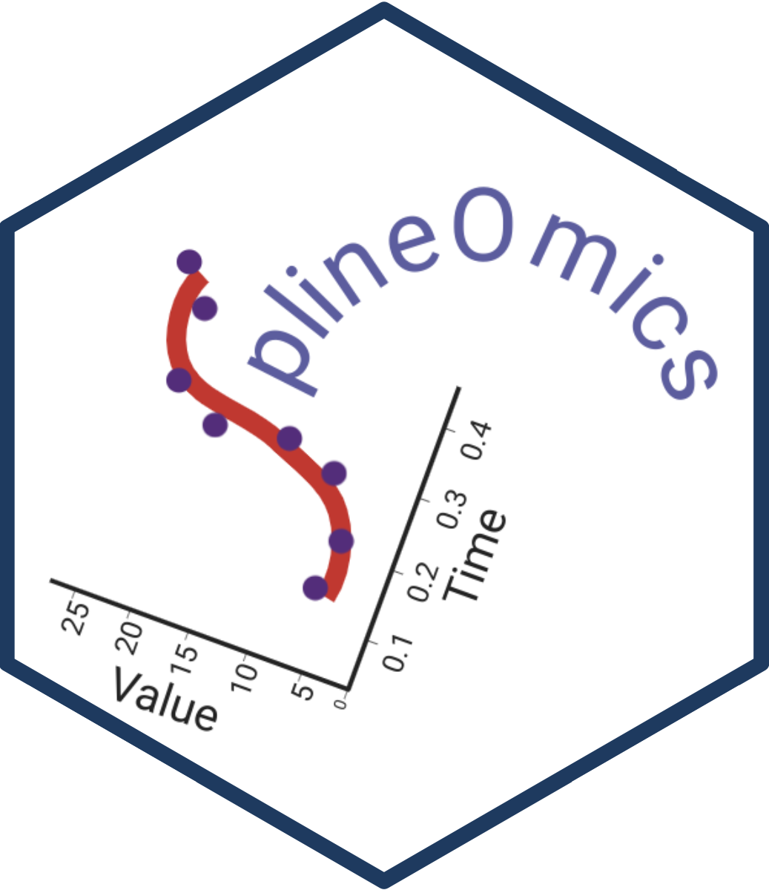
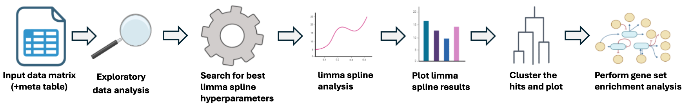

# SplineOmics

[](./LICENSE)

[](https://github.com/csbg/SplineOmics/actions/workflows/R-CMD-check.yaml)
[](https://hub.docker.com/r/thomasrauter/splineomics)




The R package `SplineOmics` finds the significant features (hits) of
time-series -omics data by using splines and `limma` for hypothesis
testing. It then clusters the hits based on the spline shape while
showing all results in summary HTML reports.

The graphical abstract below shows the full workflow streamlined by
`SplineOmics`:

<figure>

<figcaption aria-hidden="true">Graphical Abstract of SplineOmics
Workflow</figcaption>
</figure>

## Table of Contents

- [📘 Introduction](#-introduction)
- [🔧 Installation](#-installation)
  - [🐳 Docker Container](#-docker-container)
- [▶️ Usage](#-usage)
  - [🎓 Tutorial](#-tutorial)
  - [📋 Details](#-details)
  - [🧬 RNA-seq and Glycan Data](#-rna-seq-and-glycan-data)
- [📦 Dependencies](#-dependencies)
- [📚 Further Reading](#-further-reading)
- [❓ Getting Help](#-getting-help)
- [💬 Feedback](#-feedback)
- [📜 License](#-license)
- [🎓 Citation](#-citation)
- [🌟 Contributors](#-contributors)
- [🙏 Acknowledgements](#-acknowledgements)

## 📘 Introduction

Welcome to `SplineOmics`, an R package designed to streamline the
analysis of -omics time-series data, followed by automated HTML report
generation.

### Is the SplineOmics package of use for me?

If you have -omics data over time, the package will help you to run
`limma` with splines, perform the clustering, run ORA and show result
plots in HTML reports. Any time-series data that is a valid input to the
`limma` package is also a valid input to the `SplineOmics` package (such
as transcriptomics, proteomics, phosphoproteomics, metabolomics, glycan
fractional abundances, etc.).

### What do I need precisely?

1.  **Data**: A data matrix where each row is a feature (e.g., protein,
    metabolite, etc.) and each column is a sample taken at a specific
    time. The data must have no NA values, should have normally
    distributed features and no dependence between the samples.

2.  **Meta**: A table with metadata on the columns/samples of the data
    matrix (e.g., batch, time point, etc.)

3.  **Annotation** (optional): A table with identifiers on the
    rows/features of the data matrix (e.g., gene and protein name).

### Capabilities

With `SplineOmics`, you can:

- **Automatically perform exploratory data analysis:**

  The `explore_data()` function generates an HTML report, containing
  various plots, such as density, PCA, and correlation heatmap plots
  ([example
  report](https://csbg.github.io/SplineOmics_html_reports/explore_data_PTX.html)).

- **Perform limma spline analysis:**

  Use the `run_limma_splines()` function to perform the `limma` analysis
  with splines once the optimal hyperparameters are identified ([example
  report](https://csbg.github.io/SplineOmics_html_reports/create_limma_report_PTX.html)).

- **Find jumps and drops in the timecourse:**

  Use the `find_pvc()` function for that ([example
  report](https://csbg.github.io/SplineOmics_html_reports/pvc_report_PPTX.html)).

- **Cluster significant features:**

  Cluster the significant features (hits) identified in the spline
  analysis with the `cluster_hits()` function ([example
  report](https://csbg.github.io/SplineOmics_html_reports/report_clustered_hits_PTX.html)).

- **Run ORA with clustered hits:**

  Perform over-representation analysis (ORA) using the clustered hits
  with the `run_ora()` function ([example
  report](https://csbg.github.io/SplineOmics_html_reports/run_ora_report.html)).

## 🔧 Installation

Follow the steps below to install the `SplineOmics` package from the
GitHub repository into your R environment.

> **Note** Carefully read the terminal messages of the installations. It
> can happen that installations fail due to missing dependencies, which
> you then must resolve using other commands not necessarily written
> down here.

#### Prerequisites

- Ensure **R** is installed on your system. If not, download and install
  it from [CRAN](https://cran.r-project.org/).
- **RStudio** is recommended for a more user-friendly experience with R.
  Download and install RStudio from
  [posit.co](https://posit.co/download/rstudio-desktop/).

#### Installation Steps

> **Note for Windows Users:**

During the installation on Windows, you might see a message indicating
that Rtools is not installed, which is typically required for compiling
R packages from source. However, for this installation, Rtools is not
necessary, and you can safely ignore this message.

1.  **Open RStudio** or your R console in a new or existing project
    folder.

2.  Create a **virtual environment** with `renv`

``` r
renv::init()
```

3.  **Install `BiocManager`** for Bioconductor dependencies (if not
    already installed)

``` r
install.packages("BiocManager")
```

4.  Install required Bioconductor packages

``` r
BiocManager::install(
  c("ComplexHeatmap", "limma", "variancePartition")
  # force = TRUE   # when encountering issues
)
```

5.  Install `remotes` for GitHub package installation

``` r
install.packages("remotes")
```

5.  **Install** the **`SplineOmics`** package from GitHub and all its
    non-Bioconductor dependencies, using `remotes`

``` r
remotes::install_github(
  "csbg/SplineOmics",   # GitHub repository
  ref = "v0.3.1",       # Specify the tag to install, e.g. v0.3.1 (check GitHub for the newest version!)
  dependencies = TRUE,  # Install all dependencies
  upgrade = "always"    # Always upgrade dependencies
  # force = TRUE        # when encountering issues
)
```

6.  **Verify** the **installation** of the `SplineOmics` package

``` r
# Verify the installation of the SplineOmics package
if ("SplineOmics" %in% rownames(installed.packages())) {
  message("SplineOmics was installed successfully.")
} else {
  message("SplineOmics installation failed. Please check for errors during installation.")
}
```

📌 **Note on documentation:**  
The website only contains the documentation for the most recent
`SplineOmics` version (also shown on the website in the top right
corner). To get the documentation of older versions, run:

``` r
help(package="SplineOmics")
```

to get the documentation of your currently installed version.

#### Troubleshooting

If you encounter errors related to dependencies or package versions
during installation, try updating your R and RStudio to the latest
versions and repeat the installation steps.

For issues specifically related to the `SplineOmics` package, check the
[Issues section](https://github.com/csbg/SplineOmics/issues) of the
GitHub repository for similar problems or to post a new issue.

### 🐳 Docker Container

Alternatively, you can run your analysis in a `Docker` container. The
underlying `Docker` image encapsulates the `SplineOmics` package
together with the necessary environment and dependencies. This ensures
higher levels of reproducibility because the analysis is carried out in
a consistent environment, independent of the operating system and its
custom configurations.

Please note that you must have the `Docker Engine` installed on your
machine. For instructions on how to install it, consult the official
[Docker Engine installation
guide](https://docs.docker.com/engine/install/).

More information about `Docker` containers can be found on the [official
Docker page](https://www.docker.com/resources/what-container/).

For instructions on downloading the image of the `SplineOmics` package
and running the container, please refer to the [Docker
instructions](https://csbg.github.io/SplineOmics/articles/Docker-instructions.html).

#### Troubleshooting

If you face “permission denied” issues on Linux distributions, check
this
[vignette](https://csbg.github.io/SplineOmics/articles/Docker_permission_denied.html).

## ▶️ Usage

### 🎓 Tutorial

[This
tutorial](https://csbg.github.io/SplineOmics/articles/get-started.html)
covers a real CHO cell time-series proteomics example from start to end.

### 📋 Details

A detailed description of all arguments and outputs of all the functions
in the package (exported and internal functions) can be found
[here](https://csbg.github.io/SplineOmics/reference/).

#### Design `limma` design formula

A quick guide on how to design a `limma` design formula can be found
[here](https://csbg.github.io/SplineOmics/articles/design_limma_design_formula.html).

An explanation of the three different `limma` results is
[here](https://csbg.github.io/SplineOmics/articles/limma_result_categories.html).

### 🧬 RNA-seq and Glycan Data

#### RNA-seq data

Transcriptomics data must be preprocessed for `limma`. You need to
provide an appropriate object, such as a `voom` object, in the
`rna_seq_data` argument of the `SplineOmics` object (see
[documentation](https://csbg.github.io/SplineOmics/reference/create_splineomics.html)).
Along with this, the normalized matrix (e.g., the `$E` slot of the
`voom` object) must be passed to the `data` argument. This allows
flexibility in preprocessing; you can use any method you prefer as long
as the final object and matrix are compatible with limma. One way to
preprocess your RNA-seq data is by using the `preprocess_rna_seq_data()`
function included in the `SplineOmics` package (see
[documentation](https://csbg.github.io/SplineOmics/reference/preprocess_rna_seq_data.html)).

[Here](https://csbg.github.io/SplineOmics/articles/RNA-seq%20analysis.html)
you can find an example analysis of RNA-seq data with the SplineOmics
package.

#### Glycan fractional abundance data

The glycan fractional abundance data matrix, where each row represents a
type of glycan and the columns correspond to timepoints, must be
transformed before analysis. This preprocessing step is essential due to
the compositional nature of the data. In compositional data, an increase
in the abundance of one component (glycan) necessarily results in a
decrease in others, introducing a dependency among the variables that
can bias the analysis. One way to address this issue is by applying the
Centered Log Ratio (CLR) transformation to the data with the clr
function from the compositions package:

``` r
library(compositions)
clr_transformed_data <- clr(data_matrix)  # use as SplineOmics input
```

The results from clr transformed data can be harder to understand and
interpret however. If you prefer ease of interpretation and are fine
that the results contain some artifacts due to the compositional nature
of the data, log2 transform your data instead and use that as input for
the `SplineOmics` package.

``` r
log2_transformed_data <- log2(data_matrix)  # use as SplineOmics input
```

### R Version

Depending on the version of `SplineOmics`, for the most recent, 4.5.0 or
higher.

## ❓ Getting Help

If you encounter a bug or have a suggestion for improving the
`SplineOmics` package, we encourage you to [open an
issue](https://github.com/csbg/SplineOmics/issues) on our GitHub
repository. Before opening a new issue, please check to see if your
question or bug has already been reported by another user. This helps
avoid duplicate reports and ensures that we can address problems
efficiently.

For more detailed questions, discussions, or contributions regarding the
package’s use and development, please refer to the [GitHub
Discussions](https://github.com/csbg/SplineOmics/discussions) page for
`SplineOmics`.

## 💬 Feedback

We appreciate your feedback! Besides raising issues, you can provide
feedback in the following ways:

- **Direct Email**: Send your feedback directly to [Thomas
  Rauter](mailto:thomas.rauter@plus.ac.at).

- **Anonymous Feedback**: Use [this Google
  Form](https://forms.gle/jocMXSxLf3GrGBdT9) to provide anonymous
  feedback by answering questions.

Your feedback helps us improve the project and address any issues you
may encounter.

## 📜 License

This package is licensed under the MIT License: [LICENSE](./LICENSE)

© 2024 Thomas Rauter. All rights reserved.

## 🎓 Citation

The `SplineOmics` package is currently not published in a peer-reviewed
scientific journal or similar outlet. However, if this package helped
you in your work, consider citing this GitHub repository.

To cite this package, you can use the citation information provided in
the [`CITATION.cff`](./CITATION.cff) file.

You can also generate a citation in various formats using the
`CITATION.cff` file by visiting the top right of this repo and clicking
on the “Cite this repository” button.

Also, if you like the package, consider giving the GitHub repository a
star. Your support helps us in the continued development and improvement
of `SplineOmics`. Thank you for using our package!

## 🌟 Contributors

- [Thomas-Rauter](https://github.com/Thomas-Rauter) - 🚀 Wrote the
  package, developed the approach together with Veronika Schäpertöns
  under guidance from Nikolaus Fortelny and Wolfgang Esser-Skala.
- [Nikolaus Fortelny](https://github.com/nfortelny) - 🧠 Principal
  Investigator, provided guidance and support for the overall approach.
- [Wolfgang Esser-Skala](https://github.com/skafdasschaf) - Helped
  reviewing code, delivered improvement suggestions and scientific
  guidance to develop the approach.
- [Veronika Schäpertöns](https://github.com/VSchaepertoens) - Developed
  one internal plotting function, as well as some code for the
  exploratory data analysis plots, and the overall approach together
  with Thomas Rauter.
- [Dominik Hofreither](https://github.com/dh2305) - was (i) actively
  involved as a tester, (ii) provided datasets that helped define the
  problem addressed by the package, (iii) contributed numerous ideas
  that shaped its development, and (iv) as an end-user, provided
  feedback that improved its functionality.
- [Larissa Hofer](https://github.com/larissahofer) - contributed through
  feedback and beta-testing, and by providing the epigenetics and RNA
  datasets used as examples in the package documentation. These datasets
  were also used to define the problem addressed by the package.

## 🙏 Acknowledgements

This work was carried out in the context of the DigiTherapeutX project,
which was funded by the Austrian Science Fund (FWF). The research was
conducted under the supervision of Prof. Nikolaus Fortelny, who leads
the Computational Systems Biology working group at the Paris Lodron
University of Salzburg, Austria. You can find more information about
Prof. Fortelny’s research group
[here](https://www.plus.ac.at/biowissenschaften/der-fachbereich/arbeitsgruppen/fortelny/).
