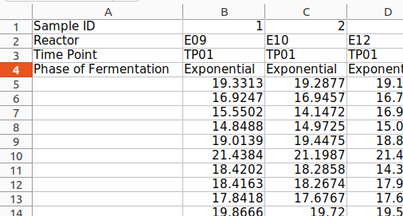
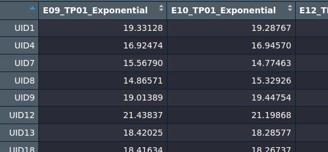
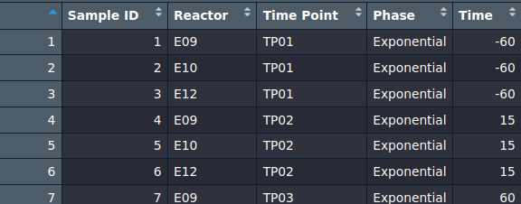

```{r, include = FALSE}
knitr::opts_chunk$set(
  collapse = TRUE,
  comment = "#>"
)
```

# About this vignette

In this vignette, all the exported functions of the SplineOmics package will be explained in detail.

# extract_data()

## Description

This function is not directly needed for the core workflow, that this package carried out. Rather, it can be seen as a convenience function. Because the Excel files, containing the results of a time-series omics experiment are not always formatted in the exact way that is needed for this packge, this function was created. It takes for example an Excel file as dataframe as input, and automatically extracts the "data matrix part", so the square or rectangle, where there is only the numeric data. Further, it combines all the column headers of one column, that maybe goes over several rows, into one. Additionally, you can specify a column or columns, which contents will be used to make a rowheader of the output dataframe containing the data. These rowheaders will be used to label the features in the plots. If skipped, the rowheaders will be increasing integers (1, 2, 3, etc.) which instead will be used to label the features in the plots.

When for example the Excel file in the beginning looks like this: 

The output dataframe of the extract_data() function looks like this: 

This dataframe can be directly used as the input for the other functions of the SplineOmics package.

## Usage

```{r extract_data() usage, eval = FALSE}
clean_data <- extract_data(data,
                           feature_name_columns = NA)
```

## Mandatory arguments

**data**:

::: {style="margin-left: 20px;"}
-   **Datatype:** [data.frame]{style="color: maroon;"}
-   **Description:** A dataframe, loaded from for example an Excel, CSV, TSV, etc. file. It must contain a quadratic or rectangular "field" where the numeric values of the data are located. On the right of that field (it must be on the right, otherwise the function will produce an error) there can be annotation information for the features, which column names can be specified to construct a unique identifier for the features.
:::

## Optional arguments

**feature_name_columns**:

::: {style="margin-left: 20px;"}
-   **Datatype:** [character]{style="color: blue;"} 
-   **Description:** A character vector of column names to use as features. If set to `NA`, all columns are used as features. Default is `NA`.
:::

## Returns

**clean_data**:

::: {style="margin-left: 20px;"}
-   **Datatype:** [data.frame]{style="color: maroon;"} 
-   **Description:** A dataframe, containing only numeric values as the elements. The column names are the combination of all the strings in the cells above the respective column in the original dataframe, that contain the numeric values. The row names are either integers (1, 2, 3, etc.) if feature_name_columns was NA, or the concatenated strings of the columns which names were provided with feature_name_columns.
:::

# explore_data()

## Description

The first step in analysing data is usually exploratory data analysis (EDA). EDA involves summarizing the main characteristics of the data, often using plots. This can involve densitiy distributions, boxplots, PCA, correlation heatmaps, and more. This process can be automatically carried out by using the package function explore_data(). The function generates an HTML report, containg all the EDA plots.

## Usage

```{r explore_data() usage, eval = FALSE}
plots <- explore_data(data,
                      meta,
                      condition,
                      report_info,
                      meta_batch_column = NA,
                      meta_batch2_column = NA,
                      report_dir = here::here(),
                      report = TRUE) 
```

## Mandatory arguments

**data**:

::: {style="margin-left: 20px;"}
-   **Datatype:** [data.frame]{style="color: maroon;"} 
-   **Description:** A dataframe, where every element is numeric and the columns represent the samples of a time-series omics experiment. The elements are the intensities/abundances/etc. of the individual features (proteins/metabolites/etc.) which are the rows of this dataframe. The row headers are the IDs of the features. (For an example see output dataframe picture in the section extract_data() ).
:::

**meta**:

::: {style="margin-left: 20px;"}
-   **Datatype:** [data.frame]{style="color: maroon;"} 
-   **Description:** A dataframe, that contains the meta information of the time-series omics experiment. Each column contains different meta information, e.g. the reactor, timepoint, etc. Each row corresponds to one specific timepoint, so each row corresponds to a column of data. It must have the column named 'Time', which must contain only numeric elements. Further, it must have a 'condition' column, that divides the experiment into different levels, for example Exponential and Stationary (two growth phases of cells). This is an example of such a meta dataframe (this is part of it): 
:::

**condition**:

::: {style="margin-left: 20px;"}
-   **Datatype:** [character]{style="color: blue;"} 
-   **Description:** The argument condition must be a character vector of length == 1, containing a string that is a column name of meta. This column contains the levels of the experiment.
:::

**report_info**:

::: {style="margin-left: 20px;"}
-   **Datatype:** [list]{style="color: olive;"} 
-   **Description:** The argument report_info must be a named list with these mandatory fields: "omics_data_type", "data_description", "data_collection_date", "analyst_name", "contact_info", "project_name". The following fields are optional: "method_description", "results_summary", "conclusions". Any other fields besides the mandatory and optional fields are not allowed. All elements of the report_info list must be strings, so character vectors of length == 1. You can write whatever you want in there, as long as it is not exceeding 80 characters. However, we recommend writing descriptive info in there. The fields are self descriptive, but for example, in the field 'omics_data_type', you could write proteomics, to remind yourself, when you look at the report after 2 years, that this was about proteomics.
:::

## Optional arguments

**meta_batch_column**:

::: {style="margin-left: 20px;"}
-   **Datatype:** [character]{style="color: blue;"} 
-   **Description:** The argument meta_batch_column must be a character vector of length == 1, containing a string that is a column name of meta. This column contains the first batch effect of the experiment, if present. If specified, the function explore_data() will generate a second HTML report, containing the same plots but with the batch effect removed from the data. The removal of the batch effect is carried out with the limma function 'removeBatchEffect'.
:::

**meta_batch2_column**:

::: {style="margin-left: 20px;"}
-   **Datatype:** [character]{style="color: blue;"} 
-   **Description:** The argument meta_batch2_column must be a character vector of length == 1, containing a string that is a column name of meta. This column contains the second batch effect of the experiment, if present. This argument can only be specified if meta_batch_column also is specified. The limma function 'removeBatchEffect' can remove up to two batch effects from the data.
:::

**report_dir**:

::: {style="margin-left: 20px;"}
-   **Datatype:** [character]{style="color: blue;"} 
-   **Description:** A valid path to a directory (when the dir is not existing yet, it will be created automatically). The HTML repors will be written to this directory.
:::

**report**:

::: {style="margin-left: 20px;"}
-   **Datatype:** [logical]{style="color: red;"} 
-   **Description:** A Boolean value (either 'TRUE' or 'FALSE') specifying if the HTML repors should be generated or not. Default is TRUE, which means the repors will be generated. It can be set to false if you are only interested in the plots inside your R session.
:::

## Returns

**plots**:

::: {style="margin-left: 20px;"}
-   **Datatype:** [list]{style="color: olive;"} 
-   **Description:** A named list, where the elements are data and optionally batch-corrected-data (if at least one meta batch column was specified). The elements are lists containing the ggplot and ComplexHeatmap plot objects of all the plots, that are put into the HTML report, in that order.
:::

# screen_limma_hyperparams()

## Description

This function allows to test different limma spline "hyperparameters" in a semi-combinatorial fashion. Examples for such "hyperparameters" are different versions of the data (full data vs. outliers removed), different limma design formulas, spline parameters, adj. p-value threshold, etc. For every type of "hyperparameter", you can just specify all the values that you want to explore, and this function runs the limma spline analysis with those parameters.

## Usage

```{r screen_limma_hyperparams() usage, eval = FALSE}
screen_limma_hyperparams(datas, 
                         datas_descr,
                         metas, 
                         designs, 
                         condition, 
                         spline_test_configs,
                         report_info,
                         report_dir = here::here(),
                         adj_pthresholds = c(0.05),
                         meta_batch_column = NA,  
                         meta_batch2_column = NA,
                         time_unit = "m",    
                         padjust_method = "BH")
```

## Mandatory arguments

**datas**:

::: {style="margin-left: 20px;"}
-   **Datatype:** [list]{style="color: olive;"} 
-   **Description:** A list of valid data dataframes (see extract_data(), Mandatory arguments, data).
:::

**datas_descr**:

::: {style="margin-left: 20px;"}
-   **Datatype:** [character]{style="color: blue;"} 
-   **Description:** A character vector, where each element is a description of the element with the same index in datas (each element describes the corresponding data dataframe)
:::

**metas**:

::: {style="margin-left: 20px;"}
-   **Datatype:** [list]{style="color: olive;"} 
-   **Description:** A list of valid meta tables (see extract_data(), Mandatory arguments, meta).
:::

**designs**:

::: {style="margin-left: 20px;"}
-   **Datatype:** [character]{style="color: blue;"} 
-   **Description:** A character vector, where each element is a valid limma design formula, such as '\~ 1 + Phase\*X + Reactor'. Each design formula must contain the capital letter X, and each meta column (such as Phase and Reactor in this example) must be present in the respective meta table of the list metas (the first element of designs corresponds to the first element of datas and metas).
:::

**condition**:

::: {style="margin-left: 20px;"}
-   **Datatype:** [character]{style="color: blue;"} 
-   **Description:** The argument condition must be a character vector of length == 1, containing a string that is a column name of meta. This column contains the levels of the experiment.
:::

**spline_test_configs**:

::: {style="margin-left: 20px;"}
-   **Datatype:** [data.frame]{style="color: maroon;"} 
-   **Description:** A dataframe, where the columns must be 'spline_type', 'degree', 'dof', 'knots', and 'bknots'. Every row is then a set of spline parameters. One such set is one value for the hyperparameter spline_params.
:::

**report_info**:

::: {style="margin-left: 20px;"}
-   **Datatype:** [list]{style="color: olive;"} 
-   **Description:** The argument report_info must be a named list with these mandatory fields: "omics_data_type", "data_description", "data_collection_date", "analyst_name", "contact_info", "project_name". The following fields are optional: "method_description", "results_summary", "conclusions". Any other fields besides the mandatory and optional fields are not allowed. All elements of the report_info list must be strings, so character vectors of length == 1. You can write whatever you want in there, as long as it is not exceeding 80 characters. However, we recommend writing descriptive info in there. The fields are self descriptive, but for example, in the field 'omics_data_type', you could write proteomics, to remind yourself, when you look at the report after 2 years, that this was about proteomics.
:::

## Optional arguments

**report_dir**:

::: {style="margin-left: 20px;"}
-   **Datatype:** [character]{style="color: blue;"} 
-   **Description:** A valid path to a directory (when the dir is not existing yet, it will be created automatically). The HTML repors will be written to this directory.
:::

**adj_pthresholds**:

::: {style="margin-left: 20px;"}
-   **Datatype:** [numeric]{style="color: green;"} 
-   **Description:** A numeric vector, where element must be 1 \> and \< 0. This vector contains the different values for the hyperparameter adj. p-value thresholds.
:::

**meta_batch_column**:

::: {style="margin-left: 20px;"}
-   **Datatype:** [character]{style="color: blue;"} 
-   **Description:** The argument meta_batch_column must be a character vector of length == 1, containing a string that is a column name of meta. This column contains the first batch effect of the experiment, if present. If specified, the function explore_data() will generate a second HTML report, containing the same plots but with the batch effect removed from the data. The removal of the batch effect is carried out with the limma function 'removeBatchEffect'.
:::

**meta_batch2_column**:

::: {style="margin-left: 20px;"}
-   **Datatype:** [character]{style="color: blue;"} 
-   **Description:** The argument meta_batch2_column must be a character vector of length == 1, containing a string that is a column name of meta. This column contains the second batch effect of the experiment, if present. This argument can only be specified if meta_batch_column also is specified. The limma function 'removeBatchEffect' can remove up to two batch effects from the data.
:::

**time_unit**:

::: {style="margin-left: 20px;"}
-   **Datatype:** [character]{style="color: blue;"} 
-   **Description:** A character vector of length == 1, that contains the string that will label the time axis in the respective plots. Can be any string with \< 16 letters, but it recommendet using strings such as min for minutes and sec for seconds, for example.
:::

**padjust_method**:

::: {style="margin-left: 20px;"}
-   **Datatype:** [character]{style="color: blue;"} 
-   **Description:** A character vector of length == 1 that contains one of the following strings (supported methods for adjusting the p-value): "holm", "hochberg", "hommel", "bonferroni", "BH", "BY", "fdr", "none". When "none" is specified, the p-value will not be adjusted (not recommendet).
:::

## Returns

**Nothing**:

::: {style="margin-left: 20px;"}
This function does not return anything. As a side-effect, it writes all the HTML reports, containing the comparison results of the different hyperparameters, to the project- or the specified dir.
:::

# run_limma_splines()

## Description

This function runs the limma spline analysis with the best hyperparameter that where found in the step before (for example using the function screen_limma_hyperparams). It returns the limma topTables, that contain the (adjusted) p-values for all the features. There are three different types of topTables returned: One containing the results for the time effect, one for the average difference between the conditions, and one for the interaction effect between condition and time.

## Usage

```{r run_limma_splines() usage, eval = FALSE}
top_tables <- run_limma_splines(data,
                                meta,
                                design,
                                condition, 
                                spline_params = 
                                  list(spline_type = c("n"),
                                       dof = c(2L)),
                                padjust_method = "BH")
```

## Mandatory arguments

**data**:

::: {style="margin-left: 20px;"}
-   **Datatype:** [data.frame]{style="color: maroon;"} 
-   **Description:** A dataframe, where every element is numeric and the columns represent the samples of a time-series omics experiment. The elements are the intensities/abundances/etc. of the individual features (proteins/metabolites/etc.) which are the rows of this dataframe. The row headers are the IDs of the features. (For an example see output dataframe picture in the section extract_data() ).
:::

**meta**:

::: {style="margin-left: 20px;"}
-   **Datatype:** [data.frame]{style="color: maroon;"} 
-   **Description:** A dataframe, that contains the meta information of the time-series omics experiment. Each column contains different meta information, e.g. the reactor, timepoint, etc. Each row corresponds to one specific timepoint, so each row corresponds to a column of data. It must have the column named 'Time', which must contain only numeric elements. Further, it must have a 'condition' column, that divides the experiment into different levels, for example Exponential and Stationary (two growth phases of cells). For an example of a meta table, see explore_data(), Mandatory arguments, meta.
:::

**design**:

::: {style="margin-left: 20px;"}
-   **Datatype:** [character]{style="color: blue;"} 
-   **Description:** A valid limma design formula, for example "\~ 1 + Phase\*X + Reactor". The formula must contain a capital X that reperesents the Time column of meta, and every other meta column (such as Phase and Reactor here) must be present in the meta dataframe.
:::

**condition**:

::: {style="margin-left: 20px;"}
-   **Datatype:** [character]{style="color: blue;"} 
-   **Description:** The argument condition must be a character vector of length == 1, containing a string that is a column name of meta. This column contains the levels of the experiment.
:::

## Optional arguments

**spline_params**:

::: {style="margin-left: 20px;"}
-   **Datatype:** [list]{style="color: olive;"} 
-   **Description:** A named list, specifying the chosen parameters for the spline analysis. The names that must be used for the respective parameters are 'spline_type', 'degree', 'dof', 'knots', and 'bknots', but not all must be used, just the ones that are defined. These parameters must be provided as vectors. If the limma design formula contains interaction effects, then the length of each vector must be 1, so every level runs with the same parameters. When there is no interaction effect in that formula, for every level there must be spline parameters specified (can also be the same one for every level). For knots and bknots, a list must be specified, where each element is a numeric vector, defining the positions of the knots or bknots, respectively. For design formulas with interaction effect, the lists must have 1 element, and for design formulas with no interaction effect, they must have an element for each level.
:::

**padjust_method**:

::: {style="margin-left: 20px;"}
-   **Datatype:** [character]{style="color: blue;"} 
-   **Description:** A character vector of length == 1 that contains one of the following strings (supported methods for adjusting the p-value): "holm", "hochberg", "hommel", "bonferroni", "BH", "BY", "fdr", "none". When "none" is specified, the p-value will not be adjusted (not recommendet).
:::

## Returns

**top_tables**:

::: {style="margin-left: 20px;"}
-   **Datatype:** [list]{style="color: olive;"} 
-   **Description:** A named list, containig the elements with the names time_diff, avrg_diff_conditions, and interaction_condition_time when the limma design formula contained interaction effects and there are more than 1 levels. If there is just one level or the limma design formula contains no interaction effects, than there is just one named element, time_diff. time_diff contains a limma topTable for every level, where the p-values describe if the spline for each feature within that level shows a significant effect over time. avrg_diff_conditions contains a limma topTable for every comparison of two levels, where the p-values describe if a feature has splines with significantly different average values in the two levels, while ignoring the time pattern. interaction_condition_time contains a limma topTable for every comparison of two levels, where the p-values describe if for a feature, the level has an effect on the temporal pattern.
:::

# create_limma_report()

## Description

The create_limma_report() function takes the output of the run_limma-splines() function and shows the result in the form of plots in an HTML report. The plots involve p-value histograms for the time_diff and interaction_condition_time topTables, and both p-value histograms and volcano plots for avrg_diff_conditions.

## Usage

```{r create_limma_report() usage, eval = FALSE}
create_limma_report(run_limma_splines_result,
                    report_info,
                    adj_pthresh = 0.05,
                    report_dir = here::here())
```

## Mandatory arguments

**run_limma_splines_result**:

::: {style="margin-left: 20px;"}
-   **Datatype:** [list]{style="color: olive;"} 
-   **Description:** The named list returned by the function run_limma_splines(). Please do not edit that list by hand.
:::

**report_info**:

::: {style="margin-left: 20px;"}
-   **Datatype:** [list]{style="color: olive;"} 
-   **Description:** The argument report_info must be a named list with these mandatory fields: "omics_data_type", "data_description", "data_collection_date", "analyst_name", "contact_info", "project_name". The following fields are optional: "method_description", "results_summary", "conclusions". Any other fields besides the mandatory and optional fields are not allowed. All elements of the report_info list must be strings, so character vectors of length == 1. You can write whatever you want in there, as long as it is not exceeding 80 characters. However, we recommend writing descriptive info in there. The fields are self descriptive, but for example, in the field 'omics_data_type', you could write proteomics, to remind yourself, when you look at the report after 2 years, that this was about proteomics.
:::

## Optional arguments

**adj_pthresh**:

::: {style="margin-left: 20px;"}
-   **Datatype:** [numeric]{style="color: green;"} 
-   **Description:** A numeric value (float) \> 0 and \< 1, that will be the adj. p-value threshold used to filter the features.
:::

**report_dir**:

::: {style="margin-left: 20px;"}
-   **Datatype:** [character]{style="color: blue;"} 
-   **Description:** A valid path to a directory (when the dir is not existing yet, it will be created automatically). The HTML repors will be written to this directory.
:::

## Returns

**Nothing**:

::: {style="margin-left: 20px;"}
This function does not return anything. As a side-effect, it writes the HTML report to the project- or the specified dir.
:::

# cluster_hits()

## Description

The function cluster_hits() clusters the hits (significant features) based on the shape of the splines that where fitted by limma to them. The shape of the splines is equal to the temporal pattern. Hierarchical clustering is used. It documents the clustering by generating a range of plots and presenting them in an HTML report.

## Usage

```{r cluster_hits() usage, eval = FALSE}
clustering_results <- cluster_hits(top_tables,
                                   data,
                                   meta,
                                   design,      
                                   condition,   
                                   report_info,   
                                   spline_params = 
                                    list(spline_type = c("n"),
                                         dof = c(2L)),
                                   adj_pthresholds = c(0.05),
                                   clusters = c("auto"),
                                   meta_batch_column = NA,   
                                   meta_batch2_column = NA,   
                                   time_unit = "min",    
                                   report_dir = here::here(),
                                   report = TRUE)
```

## Mandatory arguments

**top_tables**:

::: {style="margin-left: 20px;"}
-   **Datatype:** [list]{style="color: olive;"} 
-   **Description:** Either a list of time_diff topTables (first element of the list output of the function run_limma_splines()) for each level, or a list with two elements that are lists. In the latter case, one of those lists must be the list containing the time_diff topTables, and the other one must be either the list containing the avrg_diff_conditions- or interaction_condition_time topTables.

If the first scenario is the case, the function filters the topTables of the levels based on the specifed adj. p-value for that level, and clusters them based on the spline coefficients specified in the topTable.

If the second scenario is the case, the function filters the topTable of avrg_diff_conditions- or interaction_condition_time, but takes the spline coefficients from the time_diff topTable (because the topTables of the other categories contain spline coefficients for a comparison of two levels, which cannot directly be plotted to datapoints from one level).
:::

**data**:

::: {style="margin-left: 20px;"}
-   **Datatype:** [data.frame]{style="color: maroon;"} 
-   **Description:** A dataframe, where every element is numeric and the columns represent the samples of a time-series omics experiment. The elements are the intensities/abundances/etc. of the individual features (proteins/metabolites/etc.) which are the rows of this dataframe. The row headers are the IDs of the features. (For an example see output dataframe picture in the section extract_data() ).
:::

**meta**:

::: {style="margin-left: 20px;"}
-   **Datatype:** [data.frame]{style="color: maroon;"} 
-   **Description:** A dataframe, that contains the meta information of the time-series omics experiment. Each column contains different meta information, e.g. the reactor, timepoint, etc. Each row corresponds to one specific timepoint, so each row corresponds to a column of data. It must have the column named 'Time', which must contain only numeric elements. Further, it must have a 'condition' column, that divides the experiment into different levels, for example Exponential and Stationary (two growth phases of cells). For an example of a meta table, see explore_data(), Mandatory arguments, meta.
:::

**design**:

::: {style="margin-left: 20px;"}
-   **Datatype:** [character]{style="color: blue;"} 
-   **Description:** A valid limma design formula, for example "\~ 1 + Phase\*X + Reactor". The formula must contain a capital X that reperesents the Time column of meta, and every other meta column (such as Phase and Reactor here) must be present in the meta dataframe.
:::

**condition**:

::: {style="margin-left: 20px;"}
-   **Datatype:** [character]{style="color: blue;"} 
-   **Description:** The argument condition must be a character vector of length == 1, containing a string that is a column name of meta. This column contains the levels of the experiment.
:::

**report_info**:

::: {style="margin-left: 20px;"}
-   **Datatype:** [list]{style="color: olive;"} 
-   **Description:** The argument report_info must be a named list with these mandatory fields: "omics_data_type", "data_description", "data_collection_date", "analyst_name", "contact_info", "project_name". The following fields are optional: "method_description", "results_summary", "conclusions". Any other fields besides the mandatory and optional fields are not allowed. All elements of the report_info list must be strings, so character vectors of length == 1. You can write whatever you want in there, as long as it is not exceeding 80 characters. However, we recommend writing descriptive info in there. The fields are self descriptive, but for example, in the field 'omics_data_type', you could write proteomics, to remind yourself, when you look at the report after 2 years, that this was about proteomics.
:::

## Optional arguments

**spline_params**:

::: {style="margin-left: 20px;"}
-   **Datatype:** [list]{style="color: olive;"} 
-   **Description:** A named list, specifying the chosen parameters for the spline analysis. The names that must be used for the respective parameters are 'spline_type', 'degree', 'dof', 'knots', and 'bknots', but not all must be used, just the ones that are defined. These parameters must be provided as vectors. If the limma design formula contains interaction effects, then the length of each vector must be 1, so every level runs with the same parameters. When there is no interaction effect in that formula, for every level there must be spline parameters specified (can also be the same one for every level). For knots and bknots, a list must be specified, where each element is a numeric vector, defining the positions of the knots or bknots, respectively. For design formulas with interaction effect, the lists must have 1 element, and for design formulas with no interaction effect, they must have an element for each level.
:::

**adj_pthresholds**:

::: {style="margin-left: 20px;"}
-   **Datatype:** [numeric]{style="color: green;"} 
-   **Description:** A numeric vector, where each element is \> 0 & \< 1. The first element is the adj. p-value threshold for the first level, the second elemnt is for the second level, etc. If the second scenario is true for the top_tables argument, then each element belongs to a comparison of two levels.
:::

**clusters**:

::: {style="margin-left: 20px;"}
-   **Datatype:** [integer]{style="color: orange;"} 
-   **Description:** A numeric vector, that specifies the amount of clusters for each level or each level comparison.
:::

**meta_batch_column**:

::: {style="margin-left: 20px;"}
-   **Datatype:** [character]{style="color: blue;"}
-   **Description:** The argument `meta_batch_column` must contain a string that is a column name of `meta`. This column contains the first batch effect of the experiment, if present. If specified, the function `explore_data()` will generate a second HTML report, containing the same plots but with the batch effect removed from the data. The removal of the batch effect is carried out with the `limma` function `removeBatchEffect`.
:::

**meta_batch2_column**:

::: {style="margin-left: 20px;"}
-   **Datatype:** [character]{style="color: blue;"}
-   **Description:** The argument `meta_batch2_column` must contain a string that is a column name of `meta`. This column contains the second batch effect of the experiment, if present. This argument can only be specified if `meta_batch_column` also is specified. The `limma` function `removeBatchEffect` can remove up to two batch effects from the data.
:::

**time_unit**:

::: {style="margin-left: 20px;"}
-   **Datatype:** [character]{style="color: blue;"} 
-   **Description:** A character vector of length == 1, that contains the string that will label the time axis in the respective plots. Can be any string with \< 16 letters, but it recommendet using strings such as min for minutes and sec for seconds, for example.
:::

**report_dir**:

::: {style="margin-left: 20px;"}
-   **Datatype:** [character]{style="color: blue;"} 
-   **Description:** A valid path to a directory (when the dir is not existing yet, it will be created automatically). The HTML repors will be written to this directory.
:::

**report**:

::: {style="margin-left: 20px;"}
-   **Datatype:** [logical]{style="color: red;"} 
-   **Description:** A Boolean value (either 'TRUE' or 'FALSE') specifying if the HTML repors should be generated or not. Default is TRUE, which means the repors will be generated. It can be set to false if you are only interested in the plots inside your R session.
:::

## Returns

**clustering_results**:

::: {style="margin-left: 20px;"}
-   **Datatype:** [list]{style="color: olive;"} 
-   **Description:** A named list with three elements: 'all_levels_clustering', 'plots', and 'clustered_hits_levels'. 'all_levels_clustering' is a named list, with one element for each level. Those elements contain the clustered_hits dataframe, and all the info that was used to perform the clustering. If a level has > 2 hits (which is insufficient for clustering) then a character will be in place of all those elements, that says: "No result for this level, because the top_table had < 2 hits". Plots contains all the plots that went into the HTML report, in the order in which they appear in that report. 'clustered_hits_levels' is a convenience element of this list, that contains the clustered_hits dataframe for each level or the above stated message if there where < 2 hits.
:::

# download_enrichr_databases()

## Description

## Usage

```{r download_enrichr_databases() usage, eval = FALSE}
download_enrichr_databases(gene_set_lib,
                           output_dir = here::here())
```

## Mandatory arguments

**gene_set_lib**:

::: {style="margin-left: 20px;"}
-   **Datatype:** [character]{style="color: blue;"} 
-   **Description:** A character vector, where each element is a valid name of an Enrichr database, such as 'WikiPathways_2019_Human'. These databases will be downloaded and written to the TSV file.
:::

## Optional arguments

**output_dir**:

::: {style="margin-left: 20px;"}
-   **Datatype:** [character]{style="color: blue;"} 
-   **Description:** A valid filepath, specifying the output directory of the written databases TSV file. Default is the current working dir.
:::

## Returns

**Nothing**:

::: {style="margin-left: 20px;"}
This function does not return anything. As a side-effect, it writes the file, containing the Enrichr databases, to the project- or the specified dir.
:::

# run_gsea()

## Description

## Usage

```{r run_gsea() usage, eval = FALSE}
plots <- run_gsea(levels_clustered_hits,
                  genes,
                  databases,
                  report_info,
                  params = NA,
                  plot_titles = NA,
                  background = NULL,
                  report_dir = here::here())
```

## Mandatory arguments

**levels_clustered_hits**:

::: {style="margin-left: 20px;"}
-   **Datatype:** [data.frame]{style="color: maroon;"} 
-   **Description:** Placeholder
:::

**genes**:

::: {style="margin-left: 20px;"}
-   **Datatype:** [character]{style="color: blue;"} 
-   **Description:** A character vector, containing standardized gene names, with as many elements as there are features in data. These will be used to assign the gene to the respective feature, using the index of the feature. That is why this gene vector needs to match the original order of the feature, how they appeared in the input datafile (for example the Excel file).
:::

**databases**:

::: {style="margin-left: 20px;"}
-   **Datatype:** [data.frame]{style="color: maroon;"} 
-   **Description:** The as dataframe loaded output file of the function download_enrichr_databases(). Please do not edit that file per hand.
:::

**report_info**:

::: {style="margin-left: 20px;"}
-   **Datatype:** [list]{style="color: olive;"} 
-   **Description:** The argument report_info must be a named list with these mandatory fields: "omics_data_type", "data_description", "data_collection_date", "analyst_name", "contact_info", "project_name". The following fields are optional: "method_description", "results_summary", "conclusions". Any other fields besides the mandatory and optional fields are not allowed. All elements of the report_info list must be strings, so character vectors of length == 1. You can write whatever you want in there, as long as it is not exceeding 80 characters. However, we recommend writing descriptive info in there. The fields are self descriptive, but for example, in the field 'omics_data_type', you could write proteomics, to remind yourself, when you look at the report after 2 years, that this was about proteomics.
:::

## Optional arguments

**params**:

::: {style="margin-left: 20px;"}
-   **Datatype:** [list]{style="color: olive;"} 
-   **Description:** A named list, maximally containing the following fields: 'adj_p_value', 'pAdjustMethod', 'minGSSize', 'maxGSSize', 'qvalueCutoff' (you can use only part of those fields). These hold the desired custom parameters for clusterProfiler, that will be used for GSEA. All except 'pAdjustMethod' must be of numeric type, and one of "holm", "hochberg", "hommel", "bonferroni", "BH", "BY", "fdr", "none".
:::

**plot_titles**:

::: {style="margin-left: 20px;"}
-   **Datatype:** [character]{style="color: blue;"} 
-   **Description:** A character vector with an element for each level, specifying the title that the enricher dotplots should receive. No title will be used per default.
:::

**background**:

::: {style="margin-left: 20px;"}
-   **Datatype:** [character]{style="color: blue;"} 
-   **Description:** A character vector of valid standardized gene names that is a valid background for the clusterProfiler GSEA, for example all expressed genes (all underlying genes of all the features).
:::

**report_dir**:

::: {style="margin-left: 20px;"}
-   **Datatype:** [character]{style="color: blue;"}
-   **Description:** A valid path to a directory (when the dir is not existing yet, it will be created automatically). The HTML repors will be written to this directory.
:::

## Returns

**plots**:

::: {style="margin-left: 20px;"}
-   **Datatype:** [list]{style="color: olive;"} 
-   **Description:** A list of the ggplot objects, that represent the dotplots placed into the report. The order is the same as in the report.
:::
