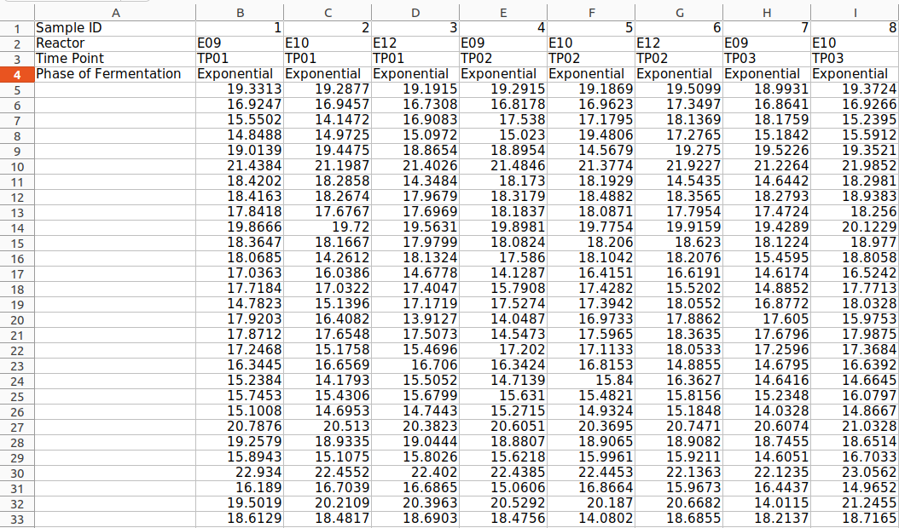
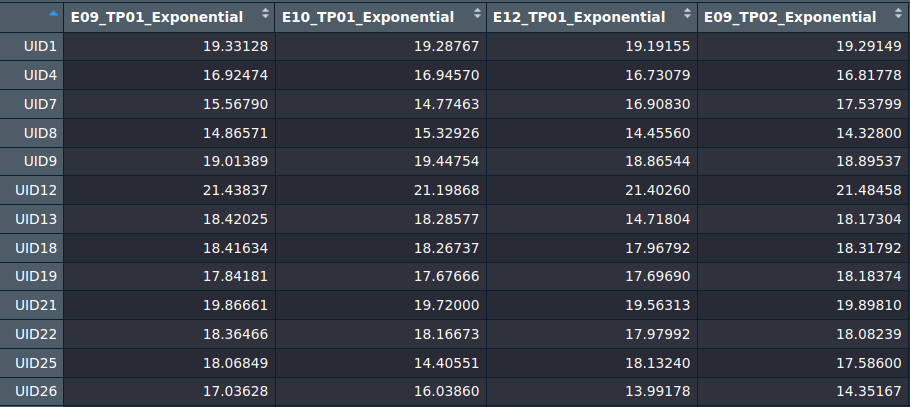
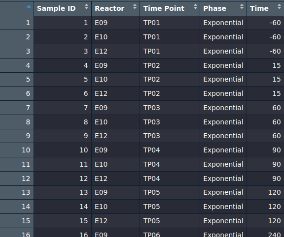

```{r, include = FALSE}
knitr::opts_chunk$set(
  collapse = TRUE,
  comment = "#>"
)
```

# About this vignette

In this vignette, all the exported functions of the SplineOmics package will be explained in detail.

# extract_data()

## Description

This function is not directly needed for the core workflow, that this package carried out. Rather, it can be seen as a convenience function. Because the Excel files, containing the results of a time-series omics experiment are not always formatted in the exact way that is needed for this packge, this function was created. It takes for example an Excel file as dataframe as input, and automatically extracts the "data matrix part", so the square or rectangle, where there is only the numeric data. Further, it combines all the column headers of one column, that maybe goes over several rows, into one. Additionally, you can specify a column or columns, which contents will be used to make a rowheader of the output dataframe containing the data. These rowheaders will be used to label the features in the plots. If skipped, the rowheaders will be increasing integers (1, 2, 3, etc.) which instead will be used to label the features in the plots.

When for example the Excel file in the beginning looks like this: 

The output dataframe of the extract_data() function looks like this: 

This dataframe can be directly used as the input for the other functions of the SplineOmics package.

## Usage

```{r extract_data() usage, eval = FALSE}
clean_data <- extract_data(data,
                           feature_name_columns = NA)
```

## Mandatory arguments

**data**:

::: {style="margin-left: 20px;"}
A dataframe, loaded from for example an Excel, CSV, TSV, etc. file. It must contain a quadratic or rectangular "field" where the numeric values of the data are located. On the right of that field (it must be on the right, otherwise the function will produce an error) there can be annotation information for the features, which column names can be specified to construct a unique identifier for the features.
:::

## Optional arguments

**feature_name_columns**:

::: {style="margin-left: 20px;"}
A character vector of column names to use as features. If set to `NA`, all columns are used as features. Default is `NA`.
:::

## Returns

**clean_data**:

::: {style="margin-left: 20px;"}
A dataframe, containing only numeric values as the elements. The column names are the combination of all the strings in the cells above the respective column in the original dataframe, that contain the numeric values. The row names are either integers (1, 2, 3, etc.) if feature_name_columns was NA, or the concatenated strings of the columns which names were provided with feature_name_columns.
:::

# explore_data()

## Description

The first step in analysing data is usually exploratory data analysis (EDA). EDA involves summarizing the main characteristics of the data, often using plots. This can involve densitiy distributions, boxplots, PCA, correlation heatmaps, and more. This process can be automatically carried out by using the package function explore_data(). The function generates an HTML report, containg all the EDA plots.

## Usage

```{r explore_data() usage, eval = FALSE}
plots <- explore_data(data,
                      meta,
                      condition,
                      report_info,
                      meta_batch_column = NA,
                      meta_batch2_column = NA,
                      report_dir = here::here(),
                      report = TRUE) 
```

## Mandatory arguments

**data**:

::: {style="margin-left: 20px;"}
A dataframe, where every element is numeric and the columns represent the samples of a time-series omics experiment. The elements are the intensities/abundances/etc. of the individual features (proteins/metabolites/etc.) which are the rows of this dataframe. The row headers are the IDs of the features. (For an example see output dataframe picture in the section extract_data() ).
:::

**meta**:

::: {style="margin-left: 20px;"}
A dataframe, that contains the meta information of the time-series omics experiment. Each column contains different meta information, e.g. the reactor, timepoint, etc. Each row corresponds to one specific timepoint, so each row corresponds to a column of data. It must have the column named 'Time', which must contain only numeric elements. Further, it must have a 'condition' column, that divides the experiment into different levels, for example Exponential and Stationary (two growth phases of cells).
This is an example of such a meta dataframe (this is part of it):

:::

**condition**:

::: {style="margin-left: 20px;"}
The argument condition must be a character vector of length == 1, containing a string that is a column name of meta. This column contains the levels of the experiment.
:::

**report_info**:

::: {style="margin-left: 20px;"}
The argument report_info must be a named list with these mandatory fields: "omics_data_type", "data_description", "data_collection_date", "analyst_name", "contact_info", "project_name". The following fields are optional: "method_description", "results_summary", "conclusions". Any other fields besides the mandatory and optional fields are not allowed. All elements of the report_info list must be strings, so character vectors of length == 1. You can write whatever you want in there, as long as it is not exceeding 80 characters. However, we recommend writing descriptive info in there. The fields are self descriptive, but for example, in the field 'omics_data_type', you could write proteomics, to remind yourself, when you look at the report after 2 years, that this was about proteomics.
:::

## Optional arguments

**meta_batch_column**:

::: {style="margin-left: 20px;"}
The argument meta_batch_column must be a character vector of length == 1, containing a string that is a column name of meta. This column contains the first batch effect of the experiment, if present. If specified, the function explore_data() will generate a second HTML report, containing the same plots but with the batch effect removed from the data. The removal of the batch effect is carried out with the limma function 'removeBatchEffect'.
:::

**meta_batch2_column**:

::: {style="margin-left: 20px;"}
The argument meta_batch_column must be a character vector of length == 1, containing a string that is a column name of meta. This column contains the second batch effect of the experiment, if present. This argument can only be specified if meta_batch_column also is specified. The limma function 'removeBatchEffect' can remove up to two batch effects from the data.
:::

**report_dir**:

::: {style="margin-left: 20px;"}
Placeholder
:::

**report**:

::: {style="margin-left: 20px;"}
Placeholder
:::

## Returns

**plots**:

::: {style="margin-left: 20px;"}
Placeholder
:::


# limma_hyperparams_screen()

## Description

## Usage

```{r limma_hyperparams_screen() usage, eval = FALSE}
limma_hyperparams_screen(datas, 
                         datas_descr,
                         metas, 
                         designs, 
                         condition, 
                         spline_test_configs,
                         report_info,
                         report_dir = here::here(),
                         adj_pthresholds = c(0.05),
                         meta_batch_column = NA,  
                         meta_batch2_column = NA,
                         time_unit = "m",    
                         padjust_method = "BH")
```

## Mandatory arguments

**datas**:

::: {style="margin-left: 20px;"}
Placeholder
:::

**datas_descr**:

::: {style="margin-left: 20px;"}
Placeholder
:::

**metas**:

::: {style="margin-left: 20px;"}
Placeholder
:::

**designs**:

::: {style="margin-left: 20px;"}
Placeholder
:::

**condition**:

::: {style="margin-left: 20px;"}
Placeholder
:::

**spline_test_configs**:

::: {style="margin-left: 20px;"}
Placeholder
:::

**report_info**:

::: {style="margin-left: 20px;"}
Placeholder
:::

## Optional arguments

**report_dir**:

::: {style="margin-left: 20px;"}
Placeholder
:::

**adj_pthresholds**:

::: {style="margin-left: 20px;"}
Placeholder
:::

**meta_batch_column**:

::: {style="margin-left: 20px;"}
Placeholder
:::

**meta_batch2_column**:

::: {style="margin-left: 20px;"}
Placeholder
:::

**time_unit**:

::: {style="margin-left: 20px;"}
Placeholder
:::

**padjust_method**:

::: {style="margin-left: 20px;"}
Placeholder
:::

## Returns

**Nothing**:

::: {style="margin-left: 20px;"}
This function does not return anything. As a side-effect, it writes all the HTML reports, containing the comparison results of the different hyperparameters, to the project- or the specified dir.
:::


# run_limma_splines()

## Description

## Usage

```{r run_limma_splines() usage, eval = FALSE}
top_tables <- run_limma_splines(data,
                                meta,
                                design,
                                condition, 
                                spline_params = 
                                  list(spline_type = c("n"),
                                       dof = c(2L)),
                                padjust_method = "BH")
```

## Mandatory arguments

**data**:

::: {style="margin-left: 20px;"}
Placeholder
:::

**meta**:

::: {style="margin-left: 20px;"}
Placeholder
:::

**design**:

::: {style="margin-left: 20px;"}
Placeholder
:::

**condition**:

::: {style="margin-left: 20px;"}
Placeholder
:::

## Optional arguments

**spline_params**:

::: {style="margin-left: 20px;"}
Placeholder
:::

**padjust_method**:

::: {style="margin-left: 20px;"}
Placeholder
:::

## Returns

**top_tables**:

::: {style="margin-left: 20px;"}
Placeholder
:::


# limma_report()

## Description

## Usage

```{r limma_report() usage, eval = FALSE}
limma_report(header_section, 
             plots, 
             plots_sizes, 
             level_headers_info,
             output_file_path = here::here())
```

## Mandatory arguments

**header_section**:

::: {style="margin-left: 20px;"}
Placeholder
:::

**plots**:

::: {style="margin-left: 20px;"}
Placeholder
:::

**plots_sizes**:

::: {style="margin-left: 20px;"}
Placeholder
:::

**level_headers_info**:

::: {style="margin-left: 20px;"}
Placeholder
:::

## Optional arguments

**output_file_path**:

::: {style="margin-left: 20px;"}
Placeholder
:::

## Returns

**Nothing**:

::: {style="margin-left: 20px;"}
This function does not return anything. As a side-effect, it writes the HTML report to the project- or the specified dir.
:::


# cluster_hits()

## Description

## Usage

```{r cluster_hits() usage, eval = FALSE}
clustering_results <- cluster_hits(top_tables,
                                   data,
                                   meta,
                                   design,      
                                   condition,   
                                   report_info,   
                                   spline_params = 
                                    list(spline_type = c("n"),
                                         dof = c(2L)),
                                   adj_pthresholds = c(0.05),
                                   clusters = c("auto"),
                                   meta_batch_column = NA,   
                                   meta_batch2_column = NA,   
                                   time_unit = "min",    
                                   report_dir = here::here(),
                                   report = TRUE)
```

## Mandatory arguments

**top_tables**:

::: {style="margin-left: 20px;"}
Placeholder
:::

**data**:

::: {style="margin-left: 20px;"}
Placeholder
:::

**meta**:

::: {style="margin-left: 20px;"}
Placeholder
:::

**design**:

::: {style="margin-left: 20px;"}
Placeholder
:::

**condition**:

::: {style="margin-left: 20px;"}
Placeholder
:::

**report_info**:

::: {style="margin-left: 20px;"}
Placeholder
:::

## Optional arguments

**spline_params**:

::: {style="margin-left: 20px;"}
Placeholder
:::

**adj_pthresholds**:

::: {style="margin-left: 20px;"}
Placeholder
:::

**clusters**:

::: {style="margin-left: 20px;"}
Placeholder
:::

**meta_batch_column**:

::: {style="margin-left: 20px;"}
Placeholder
:::

**meta_batch2_column**:

::: {style="margin-left: 20px;"}
Placeholder
:::

**time_unit**:

::: {style="margin-left: 20px;"}
Placeholder
:::

**report_dir**:

::: {style="margin-left: 20px;"}
Placeholder
:::

**report**:

::: {style="margin-left: 20px;"}
Placeholder
:::

## Returns

**clustering_results**:

::: {style="margin-left: 20px;"}
Placeholder
:::


# download_enrichr_databases()

## Description

## Usage

```{r download_enrichr_databases() usage, eval = FALSE}
download_enrichr_databases(gene_set_lib,
                           output_dir = here::here())
```

## Mandatory arguments

**gene_set_lib**:

::: {style="margin-left: 20px;"}
Placeholder
:::

## Optional arguments

**output_dir**:

::: {style="margin-left: 20px;"}
Placeholder
:::

## Returns

**Nothing**:

::: {style="margin-left: 20px;"}
This function does not return anything. As a side-effect, it writes the file, containing the Enrichr databases, to the project- or the specified dir.
:::


# run_gsea()

## Description

## Usage

```{r run_gsea() usage, eval = FALSE}
plots <- run_gsea(levels_clustered_hits,
                  genes,
                  databases,
                  report_info,
                  params = NA,
                  plot_titles = NA,
                  background = NULL,
                  report_dir = here::here())
```

## Mandatory arguments

**levels_clustered_hits**:

::: {style="margin-left: 20px;"}
Placeholder
:::

**genes**:

::: {style="margin-left: 20px;"}
Placeholder
:::

**databases**:

::: {style="margin-left: 20px;"}
Placeholder
:::

**report_info**:

::: {style="margin-left: 20px;"}
Placeholder
:::

## Optional arguments

**params**:

::: {style="margin-left: 20px;"}
Placeholder
:::

**plot_titles**:

::: {style="margin-left: 20px;"}
Placeholder
:::

**background**:

::: {style="margin-left: 20px;"}
Placeholder
:::

**report_dir**:

::: {style="margin-left: 20px;"}
Placeholder
:::

## Returns

**plots**:

::: {style="margin-left: 20px;"}
Placeholder
:::
